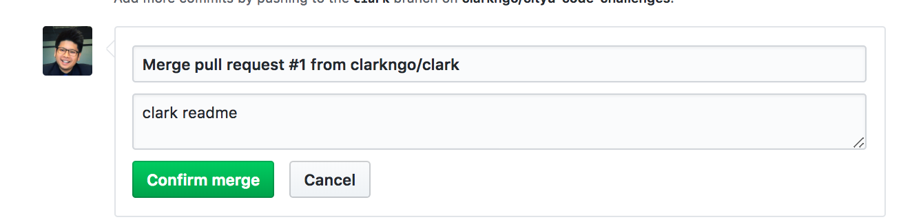

# cityu-code-challenges

## want to suggest for improvements?
Create a new issue [here](https://github.com/clarkngo/cityu-code-challenges/issues).

## install git version control

You can check your current version of Git by running the `git --version` command in a terminal (Linux, Mac OS X) or command prompt (Windows).

https://git-scm.com/book/en/v2/Getting-Started-Installing-Git

## install visual studio code
https://code.visualstudio.com/

## create github account
https://github.com/

## solve the challenge online or offline
First challenge: https://www.codewars.com/kata/5262119038c0985a5b00029f/train/javascript

Choose any programming language to solve this challenge

## have git and github account? start here! this will teach you the git workflow
clone this repo!
In your terminal

Using SSH (less prompt for user and password)
 

`git clone git@github.com:clarkngo/cityu-code-challenges.git`

OR

Using HTTPS (fine to use too, but might keep bugging you for user and password)
 
`https://github.com/clarkngo/cityu-code-challenges.git`

## Let's practice doing git branch
### In your terminal

`git checkout -b 'YOUR_FIRST_NAME'`

(for example:`git checkout -b 'clark'` )

### To check what branch you are currently using

`git branch`

### (Not needed to execute) To switch branches

`git checkout master`

OR

`git checkout YOUR_FIRST_NAME`

For now stay in YOUR_FIRST_NAME branch

## --  the git workflow --

## Go to "test" folder

add a file with YOUR_FIRST_NAME.md in test folder

`git add .`
 
`git commit -m 'YOUR_FIRST_NAME readme'`
 
`git push origin YOUR_FIRST_NAME`

## Go to GitHub

### Do compare and pull request 

### If not appearing, make sure you are on YOUR branch

### Click 

### Next

### Double check if master <- YOUR_FIRST_NAME 

### Click

### Merge pull request

### Click

### Click confirm merge

## update our local
### Switch to master branch
`git branch checkout master`

### Update our local master branch by pulling
`git pull`

### Go back to your branch and start coding again
`git checkout YOUR_FIRST_NAME`

## -- end of git / github workflow --
